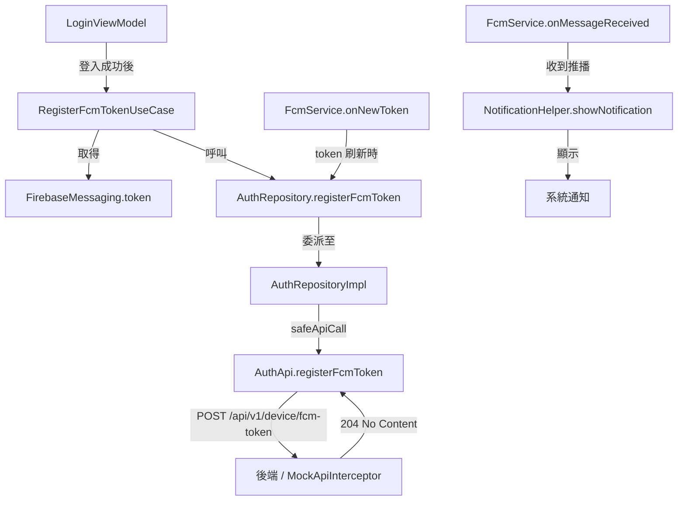
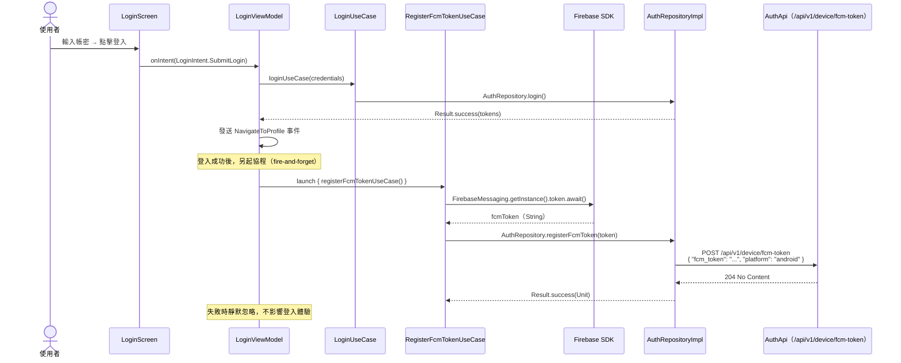

# FCM 推播整合技術文件

**專案名稱：** android_mvvm_arch  
**功能：** Firebase Cloud Messaging（FCM）推播整合  
**Firebase BOM 版本：** 33.14.0  
**日期：** 2026-05-28  

---

## 目錄

1. [概覽](#1-概覽)
2. [依賴設定](#2-依賴設定)
3. [架構說明](#3-架構說明)
4. [FCM Token 上報流程](#4-fcm-token-上報流程)
5. [Token 刷新機制](#5-token-刷新機制)
6. [推播接收](#6-推播接收)
7. [Mock 環境說明](#7-mock-環境說明)
8. [整合步驟（接入真實 Firebase）](#8-整合步驟接入真實-firebase)
9. [錯誤處理設計](#9-錯誤處理設計)
10. [相關檔案索引](#10-相關檔案索引)

---

## 1. 概覽

### FCM 在本專案中的角色

本專案整合 **Firebase Cloud Messaging（FCM）** 以支援裝置推播通知功能。FCM 在整體架構中的定位如下：

| 職責 | 說明 |
|------|------|
| **Token 管理** | 登入成功後將裝置 FCM Token 上報至後端，確保後端能針對正確裝置發送推播 |
| **Token 刷新** | Firebase SDK 定期刷新 Token 時，`FcmService.onNewToken` 自動重新上報至後端 |
| **推播接收** | App 運行中收到 FCM 推播時，由 `FcmService.onMessageReceived` 透過 `NotificationHelper` 顯示系統通知 |

### 架構定位

FCM 整合橫跨多個架構層：

- **Core 層**：`FcmService`（Firebase 服務入口，`core/fcm/`）
- **Domain 層**：`RegisterFcmTokenUseCase`（業務邏輯，`feature/auth/domain/usecase/`）
- **Data 層**：`AuthApi`、`AuthRepositoryImpl`、`RegisterFcmTokenRequestDto`（資料傳輸，`feature/auth/data/`）
- **Presentation 層**：`LoginViewModel`（觸發點，登入成功後 fire-and-forget 上報）

---

## 2. 依賴設定

### Firebase BOM 版本

本專案使用 Firebase BOM（Bill of Materials）統一管理 Firebase 依賴版本，避免各函式庫版本衝突。

```toml
# gradle/libs.versions.toml

[versions]
firebaseBom = "33.14.0"

[libraries]
firebase-messaging-ktx = { module = "com.google.firebase:firebase-messaging-ktx" }
# 版本由 BOM 統一管理，不需個別指定

[plugins]
google-services = { id = "com.google.gms.google-services", version = "4.4.2" }
```

```kotlin
// build.gradle.kts（根目錄）
plugins {
    alias(libs.plugins.google.services) apply false
}

// app/build.gradle.kts
plugins {
    alias(libs.plugins.google.services)
}

dependencies {
    implementation(platform("com.google.firebase:firebase-bom:33.14.0"))
    implementation(libs.firebase.messaging.ktx)
}
```

### 取得 `google-services.json`

> **重要：** 目前開發環境使用 Mock 模式，不依賴真實 Firebase 憑證。以下為接入真實 Firebase 時的步驟。

1. 前往 [Firebase Console](https://console.firebase.google.com/)
2. 選擇或建立專案
3. 點選「新增 Android 應用程式」
4. 填入套件名稱：`com.example.android_mvvm_arch`
5. 下載 `google-services.json`
6. 將檔案放置於 `app/` 目錄下（與 `app/build.gradle.kts` 同層）

---

## 3. 架構說明

### 各層職責

```
┌─────────────────────────────────────────────────────────────────┐
│                     Presentation Layer                          │
│  LoginViewModel                                                 │
│    └─ 登入成功後 launch { registerFcmTokenUseCase() }            │
│       （fire-and-forget，不阻斷登入流程）                         │
└───────────────────────────┬─────────────────────────────────────┘
                            │ 呼叫 UseCase
┌───────────────────────────▼─────────────────────────────────────┐
│                      Domain Layer                               │
│  RegisterFcmTokenUseCase                                        │
│    └─ FirebaseMessaging.getInstance().token.await()             │
│    └─ AuthRepository.registerFcmToken(token)                    │
└───────────────────────────┬─────────────────────────────────────┘
                            │ 實作介面
┌───────────────────────────▼─────────────────────────────────────┐
│                       Data Layer                                │
│  AuthRepositoryImpl                                             │
│    └─ safeApiCall { authApi.registerFcmToken(dto) }             │
│  RegisterFcmTokenRequestDto                                     │
│    └─ { "fcm_token": "...", "platform": "android" }             │
│  AuthApi                                                        │
│    └─ POST /api/v1/device/fcm-token                             │
└─────────────────────────────────────────────────────────────────┘

┌─────────────────────────────────────────────────────────────────┐
│                       Core Layer                                │
│  FcmService（@AndroidEntryPoint）                               │
│    ├─ onNewToken → authRepository.registerFcmToken(token)       │
│    └─ onMessageReceived → notificationHelper.showNotification() │
└─────────────────────────────────────────────────────────────────┘
```

### 資料流 Mermaid 圖



---

## 4. FCM Token 上報流程

### 登入後上報完整流程



### 關鍵設計決策：為何 fire-and-forget？

FCM Token 上報採用 **fire-and-forget（發射後不理）** 模式，原因如下：

1. **不中斷使用者體驗**：Token 上報失敗不應阻止使用者進入 App，登入體驗優先
2. **非關鍵路徑**：即使 Token 未上報，使用者仍可正常使用所有功能，僅推播可能無法送達
3. **Firebase 自動重試**：Token 刷新時，`FcmService.onNewToken` 會自動重新上報
4. **靜默失敗**：後端通常對重複上報是冪等的（idempotent），不需特別處理失敗情況

---

## 5. Token 刷新機制

### FcmService.onNewToken 邏輯

當 Firebase SDK 刷新 FCM Token 時（例如：解除安裝後重裝、清除 App 資料），`FcmService.onNewToken` 會被呼叫：

```
FcmService.onNewToken(token: String)
  ├─ 檢查：authRepository.isLoggedIn()
  │    ├─ true  → authRepository.registerFcmToken(token)（重新上報）
  │    └─ false → 不上報（使用者尚未登入，無需與帳號關聯）
  └─ 結束
```

### 觸發 Token 刷新的場景

| 場景 | Firebase 行為 | App 行為 |
|------|---------------|---------|
| 解除安裝後重裝 | 產生新 Token | `onNewToken` 觸發，已登入則上報 |
| 清除 App 資料 | 產生新 Token | `onNewToken` 觸發，需重新登入後上報 |
| Firebase 定期輪換 | 產生新 Token | `onNewToken` 觸發，已登入則自動上報 |
| 首次安裝 | 產生初始 Token | 登入時由 `RegisterFcmTokenUseCase` 主動取得並上報 |

### 為何在 FcmService 中檢查登入狀態？

`FcmService.onNewToken` 可能在使用者登出後仍被 Firebase 呼叫（例如 Token 輪換），此時將 Token 與帳號關聯無意義，故先檢查 `isLoggedIn()` 再決定是否上報。

---

## 6. 推播接收

### FcmService.onMessageReceived 邏輯

```
FcmService.onMessageReceived(message: RemoteMessage)
  ├─ 取得 title = message.notification?.title ?: message.data["title"]
  ├─ 取得 body  = message.notification?.body  ?: message.data["body"]
  └─ notificationHelper.showNotification(title, body)
        └─ NotificationManager.notify(...)
```

### NotificationHelper 整合

`FcmService` 共用既有的 `NotificationHelper`（`core/notification/`），保持通知顯示邏輯一致性：

| 功能 | 來源 | 通知管道 |
|------|------|---------|
| 背景同步通知（WorkManager） | `NotificationSyncWorker` | `general_notifications` |
| 即時推播通知（FCM） | `FcmService` | `general_notifications` |

兩者共用同一個通知 Channel（`general_notifications`），避免在系統設定中產生多個通知類別。

### AndroidManifest 設定

```xml
<!-- AndroidManifest.xml -->
<service
    android:name=".core.fcm.FcmService"
    android:exported="false">
    <intent-filter>
        <action android:name="com.google.firebase.MESSAGING_EVENT" />
    </intent-filter>
</service>
```

---

## 7. Mock 環境說明

### 開發環境不依賴真實 Firebase

本專案的 Mock 機制讓開發者在沒有真實 Firebase 專案的情況下，仍可完整測試 FCM Token 上報流程。

### MockApiInterceptor 設定

```
POST /api/v1/device/fcm-token
  → 回傳 204 No Content（空 body）
  → 模擬後端成功接收 Token
```

### 為何 FCM Token 取得在 Mock 環境中仍有效？

`RegisterFcmTokenUseCase` 使用 `FirebaseMessaging.getInstance().token.await()` 取得 Token：

- **有 `google-services.json`**：Firebase SDK 向 Firebase 伺服器請求真實 Token
- **無 `google-services.json`**（或無網路）：SDK 可能回傳測試用 Token 或拋出例外

> **開發建議：** 若要完整測試 Token 取得流程，建議在模擬器/實體裝置上安裝有 Google Play Services 的版本，並設定真實的 `google-services.json`。如果只需要測試 Token 上報 API，使用 Mock 環境已足夠（可手動傳入固定 Token 字串）。

### Mock 與真實環境切換對照

| 元件 | Mock 環境 | 真實環境 |
|------|-----------|---------|
| `RegisterFcmTokenRequestDto` 傳輸 | 由 `MockApiInterceptor` 攔截並回傳 204 | 傳至真實後端 |
| `FirebaseMessaging.token` | 依賴 Firebase SDK（需有效設定） | Firebase 伺服器發放 |
| `FcmService.onNewToken` | Firebase SDK 觸發（需有效設定） | Firebase 定期輪換時觸發 |
| `FcmService.onMessageReceived` | 需透過 FCM 測試工具手動發送 | 後端透過 FCM 伺服器推送 |

---

## 8. 整合步驟（接入真實 Firebase）

開發者需接入真實 Firebase 時，按以下步驟操作：

### 步驟一：建立 Firebase 專案

1. 前往 [Firebase Console](https://console.firebase.google.com/)
2. 點選「建立專案」，輸入專案名稱
3. 依需求選擇是否啟用 Google Analytics

### 步驟二：新增 Android 應用程式

1. 在 Firebase Console 中點選「新增應用程式」→「Android」
2. 填入 Android 套件名稱：`com.example.android_mvvm_arch`
3. 選填應用程式暱稱與 SHA-1 憑證指紋（Debug 用途可從 `./gradlew signingReport` 取得）
4. 點選「下載 `google-services.json`」

### 步驟三：放置設定檔

```
android_mvvm_arch/
└── app/
    ├── google-services.json   ← 放在此處
    └── build.gradle.kts
```

> **注意：** `google-services.json` 包含 API Key 等敏感資訊，**不應提交至版本控制**。請確認 `.gitignore` 已排除此檔案。

### 步驟四：啟用 Firebase Cloud Messaging

1. 在 Firebase Console 中，前往「Engage」→「Cloud Messaging」
2. 確認 FCM API 已啟用（新版 Firebase 預設啟用）

### 步驟五：移除 Mock 攔截（可選）

若要讓 FCM Token 上報打到真實後端，可在 `NetworkModule` 中根據 BuildConfig 移除 `MockApiInterceptor`：

```kotlin
// di/NetworkModule.kt
if (!BuildConfig.USE_MOCK_API) {
    // 不加入 MockApiInterceptor
}
```

### 步驟六：測試推播

1. 在 Firebase Console 中，前往「Cloud Messaging」→「傳送您的第一則訊息」
2. 選擇目標裝置的 FCM Token（可從 Logcat 或 Debug 介面取得）
3. 發送測試訊息，確認 `FcmService.onMessageReceived` 正確處理並顯示通知

---

## 9. 錯誤處理設計

### 為何 FCM Token 上報失敗不中斷登入流程？

FCM Token 上報失敗採用**靜默失敗（Silent Failure）**設計，核心理由：

#### 業務邏輯層面
- **登入是核心功能，推播是輔助功能**：使用者登入的主要目的是使用 App，而非確保推播可以送達
- **最終一致性（Eventual Consistency）**：即使某次上報失敗，下次 Token 刷新（`onNewToken`）或重新登入時會再次嘗試

#### 技術層面
- **網路不穩定**：行動裝置在登入時可能網路訊號不穩，FCM Token 上報失敗不應歸咎於後端問題
- **Firebase SDK 延遲**：`FirebaseMessaging.getInstance().token` 在首次啟動時可能需要時間初始化，不應強制等待

### 錯誤處理流程

```
RegisterFcmTokenUseCase.invoke()
  ├─ FirebaseMessaging.token.await() 失敗
  │    └─ 例外被 try-catch 攔截 → 靜默忽略
  └─ AuthRepository.registerFcmToken(token) 失敗
       └─ Result.failure → LoginViewModel 中的 catch 區塊 → 靜默忽略

LoginViewModel
  └─ launch {
       registerFcmTokenUseCase()
         .onFailure { /* 靜默，不更新 UI 狀態 */ }
     }
```

### 對比：登入失敗的錯誤處理

| 場景 | 錯誤處理策略 | 原因 |
|------|-------------|------|
| 登入 API 失敗 | 顯示錯誤訊息，阻止導航 | 核心功能，使用者需知道登入失敗 |
| FCM Token 上報失敗 | 靜默忽略，不影響導航 | 輔助功能，失敗不影響使用者體驗 |
| Token 刷新後上報失敗 | `FcmService.onNewToken` 中靜默忽略 | 下次輪換時會自動重試 |

---

## 10. 相關檔案索引

### 新增檔案

| 檔案路徑 | 類別/介面 | 職責 |
|---------|----------|------|
| `core/fcm/FcmService.kt` | `FcmService` | Firebase 推播服務入口，處理 Token 刷新與訊息接收 |
| `feature/auth/domain/usecase/RegisterFcmTokenUseCase.kt` | `RegisterFcmTokenUseCase` | 取得 FCM Token 並呼叫 Repository 上報 |
| `feature/auth/data/remote/dto/RegisterFcmTokenRequestDto.kt` | `RegisterFcmTokenRequestDto` | FCM Token 上報請求 DTO |

### 修改檔案

| 檔案路徑 | 修改內容 |
|---------|---------|
| `gradle/libs.versions.toml` | 加入 `firebaseBom`、`firebase-messaging-ktx`、`google-services` plugin |
| `build.gradle.kts`（根目錄） | 加入 `google-services` plugin（`apply false`） |
| `app/build.gradle.kts` | 套用 `google-services` plugin；加入 Firebase BOM 與 `firebase-messaging-ktx` |
| `feature/auth/data/remote/AuthApi.kt` | 加入 `POST /api/v1/device/fcm-token` 端點 |
| `feature/auth/domain/repo/AuthRepository.kt` | 介面新增 `registerFcmToken(token: String): Result<Unit>` |
| `feature/auth/data/repo/AuthRepositoryImpl.kt` | 實作 `registerFcmToken`，透過 `safeApiCall` 呼叫 API |
| `feature/auth/presentation/viewmodel/LoginViewModel.kt` | 注入 `RegisterFcmTokenUseCase`，登入成功後 fire-and-forget 觸發 |
| `AndroidManifest.xml` | 註冊 `FcmService` 並設定 intent-filter |
| `core/network/MockApiInterceptor.kt` | 加入 `POST /api/v1/device/fcm-token` mock 回應（204） |
| `core/notification/NotificationHelper.kt` | 新增 `showNotification(title, body)` overload |

### API 端點

| 方法 | 路徑 | 請求體 | 回應 |
|------|------|--------|------|
| `POST` | `/api/v1/device/fcm-token` | `{ "fcm_token": "string", "platform": "android" }` | `204 No Content` |

### 相關文件

- 主 SDD：`doc/SDD.md`（FCM 章節）
- 類別圖：`doc/class-diagram.md`
- 循序圖：`doc/sequence-diagram.md`
