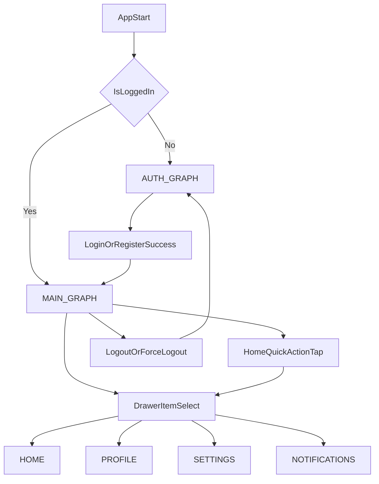

# Software Design Document (SDD)
# Drawer Navigation for Post-Login Main Flow

**專案名稱：** android_mvvm_arch  
**套件名稱：** `com.example.android_mvvm_arch`  
**版本：** 1.0.0  
**架構風格：** Clean Architecture + MVVM + MVI + Navigation Compose  
**語言：** Kotlin  
**日期：** 2026-05-27  

---

## 1. 背景與目標

目前登入後雖已進入 `HomeDashboard`，但主功能導覽同時存在「頁面內按鈕導向」與「頁面間 push/pop 返回」，造成導航心智模型不一致。  
本文件定義登入後主殼層改造：以 `ModalNavigationDrawer` 作為唯一主導航入口，讓 Home、Profile、Settings、Notifications 同屬頂層目的地。

### 設計目標

| 目標 | 說明 |
|------|------|
| 單一主導航入口 | Drawer item 與 Dashboard quick actions 共用同一套 route 切換邏輯 |
| 明確圖層分離 | Auth 與 Main 使用巢狀 graph（`AUTH_GRAPH` / `MAIN_GRAPH`） |
| 行為一致 | Main 區畫面共用 TopAppBar，避免每頁不同返回語意 |
| 可維護 | 以 `mainDrawerDestinations` 集中管理標題/圖示/route |

### 非目標

- 不改成 View 系統 `DrawerLayout`。
- 不重寫既有 Domain/Data 層。
- 不變更登入驗證或 API 契約。

---

## 2. 組件責任

| 元件 | 位置 | 責任 |
|------|------|------|
| `Routes` | `app/.../navigation/Routes.kt` | 定義 graph route、main destination 集合與標題映射 |
| `MainDrawerDestination` | `app/.../navigation/MainDrawerDestination.kt` | 定義 Drawer item 的 route/label/icon |
| `AppNavGraph` | `app/.../navigation/AppNavGraph.kt` | 組裝 `ModalNavigationDrawer + Scaffold + NavHost`，並切分 Auth/Main graph |
| `HomeScreen` | `app/.../feature/home/presentation/ui/HomeScreen.kt` | 在 MainShell 模式下關閉內建 TopBar，QuickAction 交由主導航切換 |
| `ProfileScreen` | `app/.../feature/profile/presentation/ui/ProfileScreen.kt` | 支援 MainShell 模式（關閉內建 TopBar） |
| `SettingsScreen` | `app/.../feature/settings/presentation/ui/SettingsScreen.kt` | 支援 MainShell 模式（關閉內建 TopBar） |
| `NotificationsScreen` | `app/.../feature/notifications/presentation/ui/NotificationsScreen.kt` | 支援 MainShell 模式（關閉內建 TopBar） |

---

## 3. 導航狀態機與資料流

### 主流程規則

1. `startDestination` 由 `MainViewModel` 產生（`home` 或 `login`）。
2. `AppNavGraph` 將 `startDestination` 映射為 `MAIN_GRAPH` 或 `AUTH_GRAPH`。
3. 主區切換一律走 `navigateToMainDestination(route)`，並啟用 `saveState/restoreState`。
4. 登出一律 `popUpTo(Routes.MAIN_GRAPH) { inclusive = true }`，確保主區堆疊不殘留。

---

## 4. Deep Link 與邊界案例

| 案例 | 行為 |
|------|------|
| 已登入 + 點擊系統通知 deep link 到 `notifications` | 直接導向 `Routes.NOTIFICATIONS`，Drawer 自動高亮通知項目 |
| 未登入收到 deep link | 維持登入流程，不繞過 `AUTH_GRAPH` |
| 強制登出（`AuthEvent.ForceLogout`） | `startDestination` 變更為 `login`，重建 NavHost，回到 Auth 區 |
| Home quick actions 與 Drawer 同 route | 共用同一導航函式，不維護第二套路由 |

---

## 5. 遷移策略

1. 新增導航常數與 Drawer 項目模型。
2. 將 `AppNavGraph` 重構為 `AUTH_GRAPH` + `MAIN_GRAPH`，導入 `ModalNavigationDrawer`。
3. 將 Home/Profile/Settings/Notifications 改為可切換「內建 TopBar 顯示模式」。
4. 由 MainShell 提供共用 TopAppBar 與 drawer 打開入口。
5. 更新 SDD、class diagram、sequence diagram 對應內容。

---

## 6. 回歸測試清單

### 功能驗證

- [ ] App 冷啟動已登入時，預設進入 `Home` 並可開啟 Drawer。
- [ ] Drawer 可切換 `Home/Profile/Settings/Notifications`。
- [ ] Home quick action 點擊後與 Drawer 相同路由行為。
- [ ] 系統通知 deep link 進入 `Notifications` 時 Drawer 高亮正確。
- [ ] Profile/Settings 登出後回到 Login，返回鍵不回到主區。

### 回歸驗證

- [ ] `Login -> Home` 流程正常。
- [ ] `Register -> Home` 流程正常。
- [ ] `ForceLogout -> Login` 流程正常。
- [ ] Home/Notifications 下拉刷新不受 Drawer 改造影響。
- [ ] Settings 的 Theme 與語言切換不受影響。

---

## 7. 實作者注意事項

- 主導航標題應以 `Routes.titleForRoute(currentRoute)` 為唯一來源，避免多處硬編碼。
- 新增頂層頁面時，同步更新：
  - `Routes.mainDestinations`
  - `mainDrawerDestinations`
  - `Routes.titleForRoute`
  - `doc/class-diagram.md` 與 `doc/sequence-diagram.md` 對應章節
