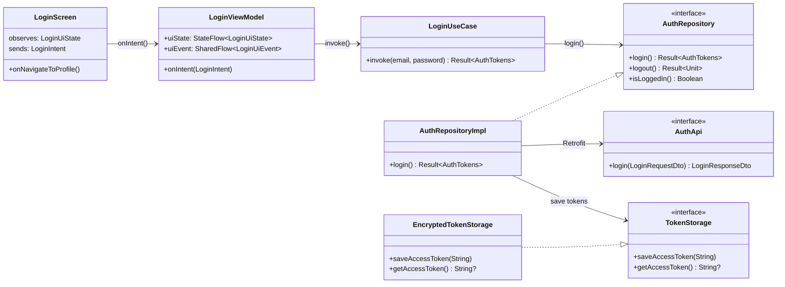
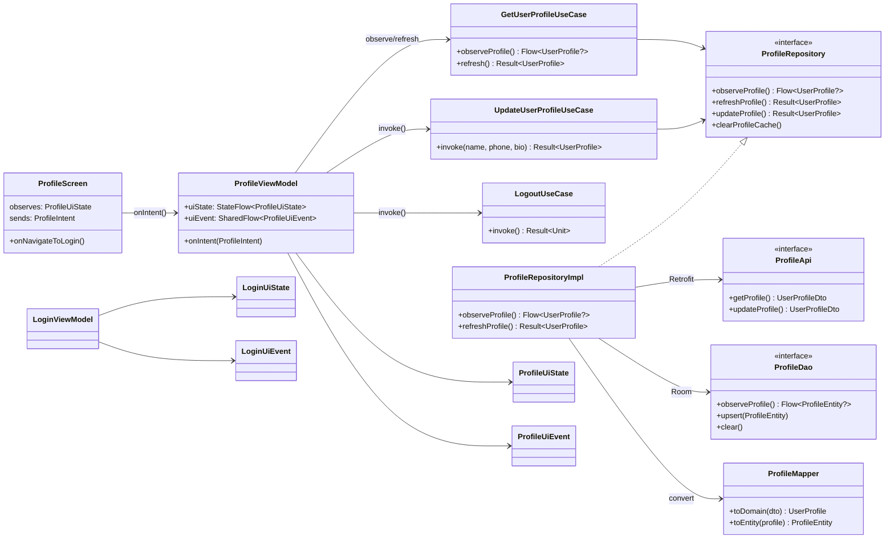
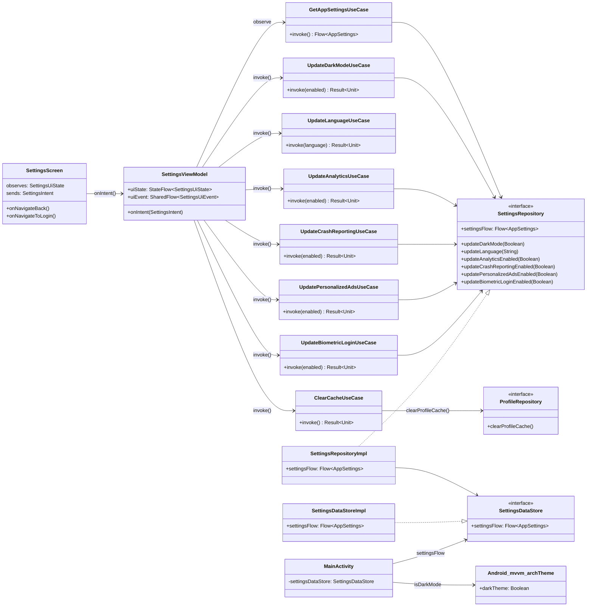
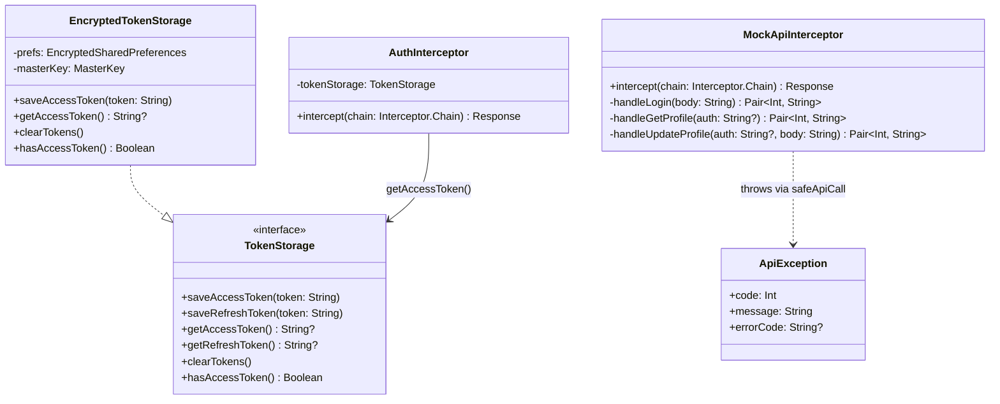
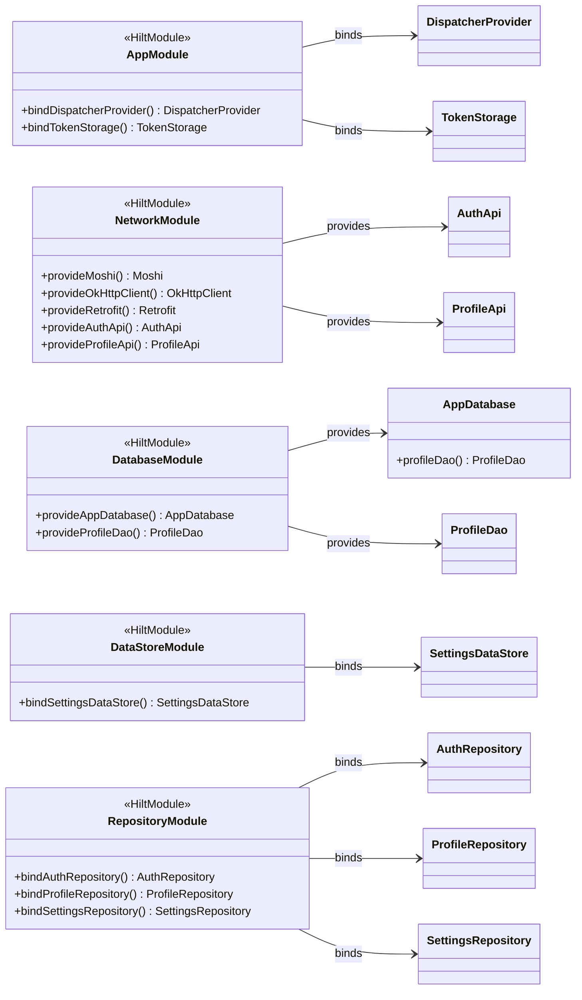

# 類別圖 (Class Diagram)
# Android MVVM Architecture — Auth, Profile & Settings

> 使用 [Mermaid](https://mermaid.js.org/) 語法繪製，可在 GitHub、GitLab、Markdown 預覽工具中直接渲染。

---

## 1. 完整架構類別圖

```mermaid
classDiagram
    direction TB

    %% ─────────── Domain Layer ───────────
    namespace DomainAuth {
        class LoginCredentials {
            +email: String
            +password: String
        }
        class AuthTokens {
            +accessToken: String
            +refreshToken: String
            +expiresInSeconds: Long
            +tokenType: String
        }
        class AuthRepository {
            <<interface>>
            +login(credentials: LoginCredentials) Result~AuthTokens~
            +logout() Result~Unit~
            +isLoggedIn() Boolean
        }
        class LoginUseCase {
            -authRepository: AuthRepository
            -dispatcherProvider: DispatcherProvider
            +invoke(email: String, password: String) Result~AuthTokens~
        }
        class LogoutUseCase {
            -authRepository: AuthRepository
            -dispatcherProvider: DispatcherProvider
            +invoke() Result~Unit~
        }
        class IsLoggedInUseCase {
            -authRepository: AuthRepository
            -dispatcherProvider: DispatcherProvider
            +invoke() Boolean
        }
    }

    namespace DomainProfile {
        class UserProfile {
            +id: String
            +email: String
            +displayName: String
            +avatarUrl: String?
            +phone: String?
            +bio: String?
            +createdAt: String
            +updatedAt: String
        }
        class ProfileUpdate {
            +displayName: String?
            +phone: String?
            +bio: String?
        }
        class ProfileRepository {
            <<interface>>
            +observeProfile() Flow~UserProfile?~
            +refreshProfile() Result~UserProfile~
            +updateProfile(update: ProfileUpdate) Result~UserProfile~
            +clearProfileCache()
        }
        class GetUserProfileUseCase {
            -profileRepository: ProfileRepository
            -dispatcherProvider: DispatcherProvider
            +observeProfile() Flow~UserProfile?~
            +refresh() Result~UserProfile~
        }
        class UpdateUserProfileUseCase {
            -profileRepository: ProfileRepository
            -dispatcherProvider: DispatcherProvider
            +invoke(displayName: String, phone: String, bio: String) Result~UserProfile~
        }
    }

    namespace DomainSettings {
        class AppSettings {
            +isDarkMode: Boolean
            +language: String
            +notificationsEnabled: Boolean
            +analyticsEnabled: Boolean
            +crashReportingEnabled: Boolean
            +personalizedAdsEnabled: Boolean
            +biometricLoginEnabled: Boolean
        }
        class SettingsRepository {
            <<interface>>
            +settingsFlow: Flow~AppSettings~
            +updateDarkMode(enabled: Boolean)
            +updateLanguage(language: String)
            +updateNotificationsEnabled(enabled: Boolean)
            +updateAnalyticsEnabled(enabled: Boolean)
            +updateCrashReportingEnabled(enabled: Boolean)
            +updatePersonalizedAdsEnabled(enabled: Boolean)
            +updateBiometricLoginEnabled(enabled: Boolean)
        }
        class GetAppSettingsUseCase {
            -settingsRepository: SettingsRepository
            +invoke() Flow~AppSettings~
        }
        class UpdateDarkModeUseCase {
            -settingsRepository: SettingsRepository
            -dispatcherProvider: DispatcherProvider
            +invoke(enabled: Boolean) Result~Unit~
        }
        class UpdateLanguageUseCase {
            -settingsRepository: SettingsRepository
            -dispatcherProvider: DispatcherProvider
            +invoke(language: String) Result~Unit~
        }
        class UpdateNotificationsUseCase {
            -settingsRepository: SettingsRepository
            -dispatcherProvider: DispatcherProvider
            +invoke(enabled: Boolean) Result~Unit~
        }
        class UpdateAnalyticsUseCase {
            -settingsRepository: SettingsRepository
            -dispatcherProvider: DispatcherProvider
            +invoke(enabled: Boolean) Result~Unit~
        }
        class UpdateCrashReportingUseCase {
            -settingsRepository: SettingsRepository
            -dispatcherProvider: DispatcherProvider
            +invoke(enabled: Boolean) Result~Unit~
        }
        class UpdatePersonalizedAdsUseCase {
            -settingsRepository: SettingsRepository
            -dispatcherProvider: DispatcherProvider
            +invoke(enabled: Boolean) Result~Unit~
        }
        class UpdateBiometricLoginUseCase {
            -settingsRepository: SettingsRepository
            -dispatcherProvider: DispatcherProvider
            +invoke(enabled: Boolean) Result~Unit~
        }
        class ClearCacheUseCase {
            -profileRepository: ProfileRepository
            -dispatcherProvider: DispatcherProvider
            +invoke() Result~Unit~
        }
    }

    %% ─────────── Data Layer ───────────
    namespace DataAuth {
        class AuthApi {
            <<interface>>
            +login(request: LoginRequestDto) LoginResponseDto
            +logout()
        }
        class LoginRequestDto {
            +email: String
            +password: String
        }
        class LoginResponseDto {
            +accessToken: String
            +refreshToken: String
            +expiresIn: Long
            +tokenType: String
        }
        class ApiErrorDto {
            +error: String?
            +message: String?
        }
        class AuthMapper {
            +toLoginRequestDto(credentials: LoginCredentials) LoginRequestDto
            +toDomain(dto: LoginResponseDto) AuthTokens
        }
        class AuthRepositoryImpl {
            -authApi: AuthApi
            -authMapper: AuthMapper
            -tokenStorage: TokenStorage
            -profileRepository: ProfileRepository
            +login(credentials: LoginCredentials) Result~AuthTokens~
            +logout() Result~Unit~
            +isLoggedIn() Boolean
        }
    }

    namespace DataProfile {
        class ProfileApi {
            <<interface>>
            +getProfile() UserProfileDto
            +updateProfile(request: UpdateProfileRequestDto) UserProfileDto
        }
        class UserProfileDto {
            +id: String
            +email: String
            +displayName: String
            +avatarUrl: String?
            +phone: String?
            +bio: String?
            +createdAt: String
            +updatedAt: String
        }
        class UpdateProfileRequestDto {
            +displayName: String?
            +phone: String?
            +bio: String?
        }
        class ProfileEntity {
            <<Entity>>
            +id: String
            +email: String
            +displayName: String
            +avatarUrl: String?
            +phone: String?
            +bio: String?
            +createdAt: String
            +updatedAt: String
        }
        class ProfileDao {
            <<interface>>
            +observeProfile() Flow~ProfileEntity?~
            +getProfile() ProfileEntity?
            +upsert(profile: ProfileEntity)
            +clear()
        }
        class ProfileMapper {
            +toDomain(dto: UserProfileDto) UserProfile
            +toDomain(entity: ProfileEntity) UserProfile
            +toEntity(profile: UserProfile) ProfileEntity
            +toUpdateRequestDto(update: ProfileUpdate) UpdateProfileRequestDto
        }
        class ProfileRepositoryImpl {
            -profileApi: ProfileApi
            -profileDao: ProfileDao
            -profileMapper: ProfileMapper
            +observeProfile() Flow~UserProfile?~
            +refreshProfile() Result~UserProfile~
            +updateProfile(update: ProfileUpdate) Result~UserProfile~
            +clearProfileCache()
        }
    }

    namespace DataSettings {
        class SettingsDataStore {
            <<interface>>
            +settingsFlow: Flow~AppSettings~
            +updateDarkMode(enabled: Boolean)
            +updateLanguage(language: String)
            +updateNotificationsEnabled(enabled: Boolean)
            +updateAnalyticsEnabled(enabled: Boolean)
            +updateCrashReportingEnabled(enabled: Boolean)
            +updatePersonalizedAdsEnabled(enabled: Boolean)
            +updateBiometricLoginEnabled(enabled: Boolean)
        }
        class SettingsDataStoreImpl {
            -dataStore: DataStore~Preferences~
            +settingsFlow: Flow~AppSettings~
            +updateDarkMode(enabled: Boolean)
            +updateLanguage(language: String)
            +updateNotificationsEnabled(enabled: Boolean)
            +updateAnalyticsEnabled(enabled: Boolean)
            +updateCrashReportingEnabled(enabled: Boolean)
            +updatePersonalizedAdsEnabled(enabled: Boolean)
            +updateBiometricLoginEnabled(enabled: Boolean)
        }
        class SettingsRepositoryImpl {
            -settingsDataStore: SettingsDataStore
            +settingsFlow: Flow~AppSettings~
            +updateDarkMode(enabled: Boolean)
            +updateLanguage(language: String)
            +updateNotificationsEnabled(enabled: Boolean)
            +updateAnalyticsEnabled(enabled: Boolean)
            +updateCrashReportingEnabled(enabled: Boolean)
            +updatePersonalizedAdsEnabled(enabled: Boolean)
            +updateBiometricLoginEnabled(enabled: Boolean)
        }
    }

    %% ─────────── Core Layer ───────────
    namespace Core {
        class TokenStorage {
            <<interface>>
            +saveAccessToken(token: String)
            +saveRefreshToken(token: String)
            +getAccessToken() String?
            +getRefreshToken() String?
            +clearTokens()
            +hasAccessToken() Boolean
        }
        class EncryptedTokenStorage {
            -prefs: SharedPreferences
            +saveAccessToken(token: String)
            +getAccessToken() String?
            +clearTokens()
        }
        class DispatcherProvider {
            <<interface>>
            +io: CoroutineDispatcher
            +default: CoroutineDispatcher
            +main: CoroutineDispatcher
        }
        class ApiException {
            +code: Int
            +message: String
            +errorCode: String?
        }
        class AuthInterceptor {
            -tokenStorage: TokenStorage
            +intercept(chain: Chain) Response
        }
        class MockApiInterceptor {
            +intercept(chain: Chain) Response
        }
        class SettingsDataStore {
            <<interface>>
            +settingsFlow: Flow~AppSettings~
        }
        class SettingsDataStoreImpl {
            -dataStore: DataStore~Preferences~
            +settingsFlow: Flow~AppSettings~
        }
        class AppSettings {
            +isDarkMode: Boolean
            +language: String
            +notificationsEnabled: Boolean
        }
    }

    %% ─────────── Presentation Layer ───────────
    namespace PresentationAuth {
        class LoginUiState {
            +email: String
            +password: String
            +isLoading: Boolean
            +errorMessage: String?
        }
        class LoginUiEvent {
            <<sealed interface>>
            NavigateToProfile
            ShowMessage
        }
        class LoginIntent {
            <<sealed interface>>
            EmailChanged
            PasswordChanged
            SubmitLogin
        }
        class LoginViewModel {
            -loginUseCase: LoginUseCase
            +uiState: StateFlow~LoginUiState~
            +uiEvent: SharedFlow~LoginUiEvent~
            +onIntent(intent: LoginIntent)
        }
    }

    namespace PresentationProfile {
        class ProfileUiState {
            +profile: UserProfile?
            +displayName: String
            +phone: String
            +bio: String
            +isLoading: Boolean
            +isSaving: Boolean
            +isEditing: Boolean
            +errorMessage: String?
            +successMessage: String?
        }
        class ProfileUiEvent {
            <<sealed interface>>
            NavigateToLogin
        }
        class ProfileIntent {
            <<sealed interface>>
            Refresh
            StartEditing
            CancelEditing
            DisplayNameChanged
            PhoneChanged
            BioChanged
            SaveProfile
            Logout
        }
        class ProfileViewModel {
            -getUserProfileUseCase: GetUserProfileUseCase
            -updateUserProfileUseCase: UpdateUserProfileUseCase
            -logoutUseCase: LogoutUseCase
            +uiState: StateFlow~ProfileUiState~
            +uiEvent: SharedFlow~ProfileUiEvent~
            +onIntent(intent: ProfileIntent)
        }
    }

    namespace PresentationSettings {
        class SettingsUiState {
            +isDarkMode: Boolean
            +language: String
            +notificationsEnabled: Boolean
            +analyticsEnabled: Boolean
            +crashReportingEnabled: Boolean
            +personalizedAdsEnabled: Boolean
            +biometricLoginEnabled: Boolean
            +errorMessage: String?
        }
        class SettingsUiEvent {
            <<sealed interface>>
            NavigateBack
            NavigateToLogin
            CacheCleared
            ShowError
        }
        class SettingsIntent {
            <<sealed interface>>
            DarkModeChanged
            LanguageChanged
            NotificationsChanged
            UpdateAnalytics
            UpdateCrashReporting
            UpdatePersonalizedAds
            UpdateBiometricLogin
            ClearCache
            Logout
        }
        class SettingsViewModel {
            -getAppSettingsUseCase: GetAppSettingsUseCase
            -updateDarkModeUseCase: UpdateDarkModeUseCase
            -updateLanguageUseCase: UpdateLanguageUseCase
            -updateNotificationsUseCase: UpdateNotificationsUseCase
            -updateAnalyticsUseCase: UpdateAnalyticsUseCase
            -updateCrashReportingUseCase: UpdateCrashReportingUseCase
            -updatePersonalizedAdsUseCase: UpdatePersonalizedAdsUseCase
            -updateBiometricLoginUseCase: UpdateBiometricLoginUseCase
            -clearCacheUseCase: ClearCacheUseCase
            -logoutUseCase: LogoutUseCase
            +uiState: StateFlow~SettingsUiState~
            +uiEvent: SharedFlow~SettingsUiEvent~
            +onIntent(intent: SettingsIntent)
        }
        class SettingsScreen {
            +onNavigateBack()
            +onNavigateToLogin()
            observes: SettingsUiState
            sends: SettingsIntent
        }
        class MainActivity {
            -settingsDataStore: SettingsDataStore
            +onCreate()
        }
        class Android_mvvm_archTheme {
            +darkTheme: Boolean
        }
    }

    %% ─────────── 依賴關係 ───────────

    %% Domain 使用案例依賴
    LoginUseCase --> AuthRepository
    LoginUseCase --> DispatcherProvider
    LogoutUseCase --> AuthRepository
    LogoutUseCase --> DispatcherProvider
    IsLoggedInUseCase --> AuthRepository
    IsLoggedInUseCase --> DispatcherProvider
    GetUserProfileUseCase --> ProfileRepository
    GetUserProfileUseCase --> DispatcherProvider
    UpdateUserProfileUseCase --> ProfileRepository
    UpdateUserProfileUseCase --> DispatcherProvider
    GetAppSettingsUseCase --> SettingsRepository
    UpdateDarkModeUseCase --> SettingsRepository
    UpdateDarkModeUseCase --> DispatcherProvider
    UpdateLanguageUseCase --> SettingsRepository
    UpdateLanguageUseCase --> DispatcherProvider
    UpdateNotificationsUseCase --> SettingsRepository
    UpdateNotificationsUseCase --> DispatcherProvider
    UpdateAnalyticsUseCase --> SettingsRepository
    UpdateAnalyticsUseCase --> DispatcherProvider
    UpdateCrashReportingUseCase --> SettingsRepository
    UpdateCrashReportingUseCase --> DispatcherProvider
    UpdatePersonalizedAdsUseCase --> SettingsRepository
    UpdatePersonalizedAdsUseCase --> DispatcherProvider
    UpdateBiometricLoginUseCase --> SettingsRepository
    UpdateBiometricLoginUseCase --> DispatcherProvider
    ClearCacheUseCase --> ProfileRepository
    ClearCacheUseCase --> DispatcherProvider

    %% Data 實作 Domain 介面
    AuthRepositoryImpl ..|> AuthRepository
    ProfileRepositoryImpl ..|> ProfileRepository
    SettingsRepositoryImpl ..|> SettingsRepository
    SettingsDataStoreImpl ..|> SettingsDataStore
    EncryptedTokenStorage ..|> TokenStorage

    %% Data 層內部依賴
    AuthRepositoryImpl --> AuthApi
    AuthRepositoryImpl --> AuthMapper
    AuthRepositoryImpl --> TokenStorage
    AuthRepositoryImpl --> ProfileRepository
    AuthMapper --> LoginCredentials
    AuthMapper --> LoginRequestDto
    AuthMapper --> LoginResponseDto
    AuthMapper --> AuthTokens
    ProfileRepositoryImpl --> ProfileApi
    ProfileRepositoryImpl --> ProfileDao
    ProfileRepositoryImpl --> ProfileMapper
    ProfileMapper --> UserProfileDto
    ProfileMapper --> ProfileEntity
    ProfileMapper --> UserProfile
    ProfileMapper --> ProfileUpdate
    ProfileMapper --> UpdateProfileRequestDto
    SettingsRepositoryImpl --> SettingsDataStore
    SettingsDataStoreImpl --> AppSettings

    %% Presentation 依賴 Domain Use Cases
    LoginViewModel --> LoginUseCase
    ProfileViewModel --> GetUserProfileUseCase
    ProfileViewModel --> UpdateUserProfileUseCase
    ProfileViewModel --> LogoutUseCase
    SettingsViewModel --> GetAppSettingsUseCase
    SettingsViewModel --> UpdateDarkModeUseCase
    SettingsViewModel --> UpdateLanguageUseCase
    SettingsViewModel --> UpdateNotificationsUseCase
    SettingsViewModel --> UpdateAnalyticsUseCase
    SettingsViewModel --> UpdateCrashReportingUseCase
    SettingsViewModel --> UpdatePersonalizedAdsUseCase
    SettingsViewModel --> UpdateBiometricLoginUseCase
    SettingsViewModel --> ClearCacheUseCase
    SettingsViewModel --> LogoutUseCase

    %% Theme 整合
    MainActivity --> SettingsDataStore : settingsFlow
    MainActivity --> Android_mvvm_archTheme : darkTheme
    SettingsScreen --> SettingsViewModel : onIntent()
    SettingsViewModel --> SettingsUiState
    SettingsViewModel --> SettingsUiEvent
```

---

## 2. Auth 功能類別圖（簡化版）



---

## 3. Profile 功能類別圖（簡化版）



---

## 4. Settings 功能類別圖（簡化版）



---

## 5. Core 安全模組類別圖



---

## 6. DI 模組依賴關係圖


