# 循序圖 (Sequence Diagram)
# Android MVVM Architecture — Auth, Profile, Settings & Notifications

> 使用 [Mermaid](https://mermaid.js.org/) 語法繪製，可在 GitHub、GitLab、Markdown 預覽工具中直接渲染。

---

## 1. 應用程式啟動 — 路由決策

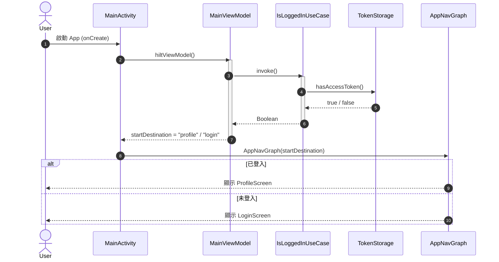

---

## 2. 使用者登入（成功路徑）

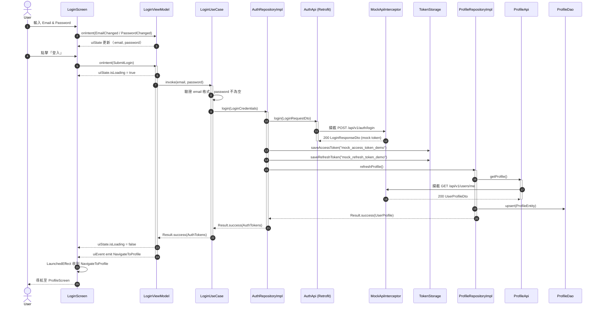

---

## 3. 使用者登入（失敗路徑）

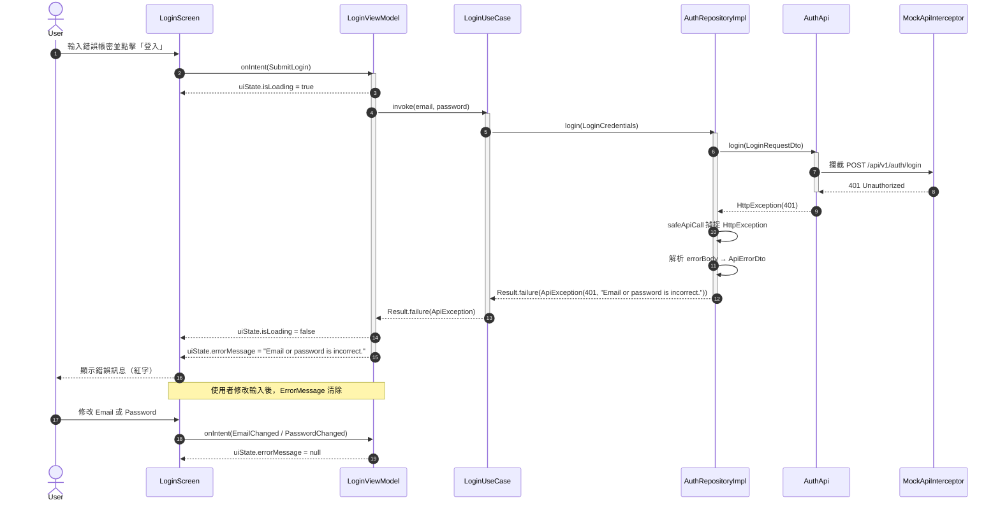

---

## 4. 輸入驗證失敗（前端）

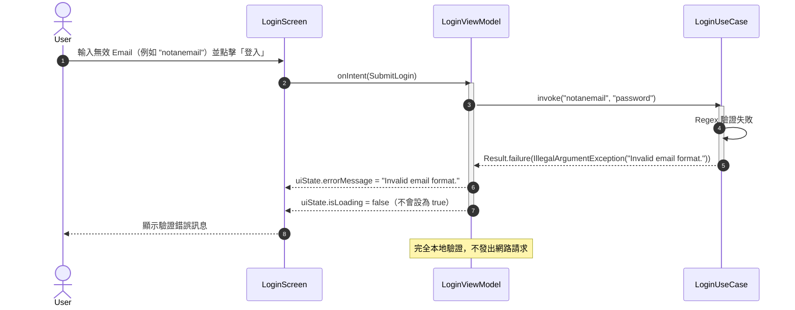

---

## 5. 個人資料頁面載入

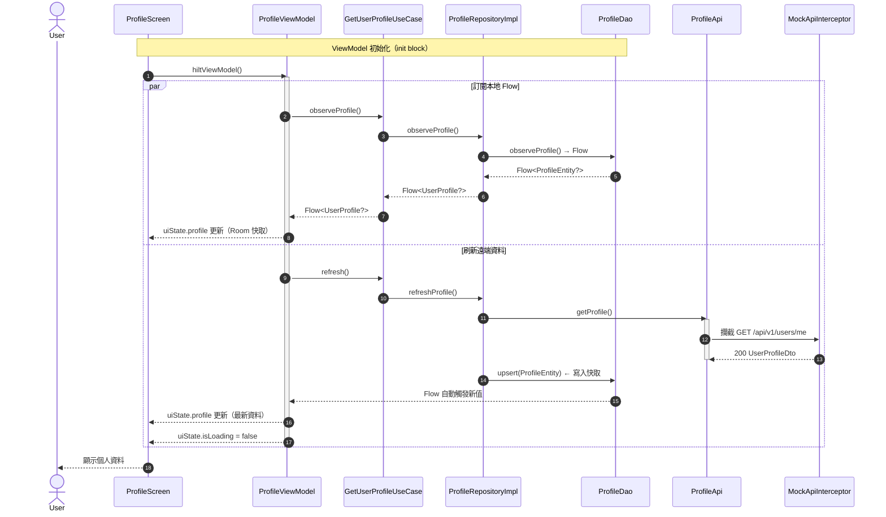

---

## 6. 編輯並儲存個人資料

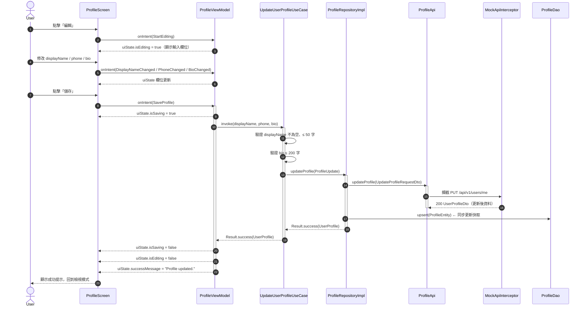

---

## 7. 編輯個人資料失敗（驗證錯誤）

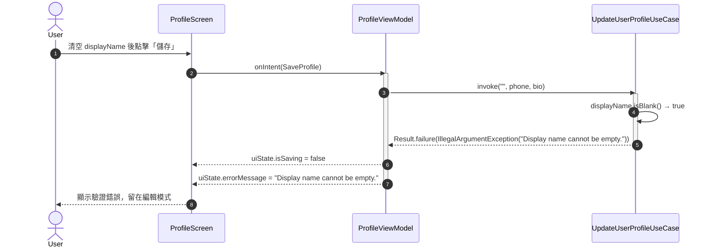

---

## 8. 使用者登出

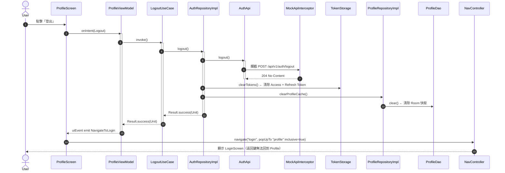

---

## 9. Token 自動附加（AuthInterceptor）

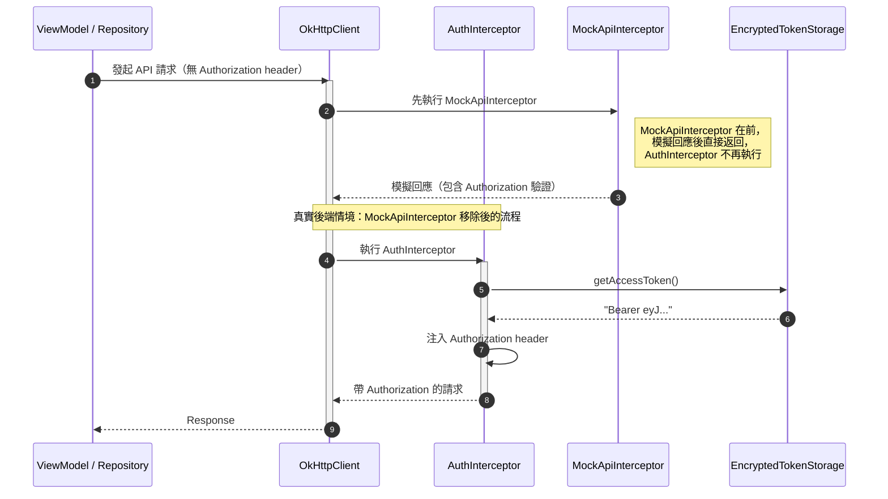

---

## 10. safeApiCall 錯誤包裝流程

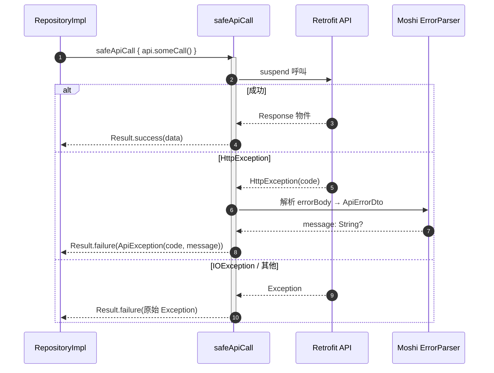

---

## 11. Settings 讀取流程（App 啟動 → DataStore → Theme）

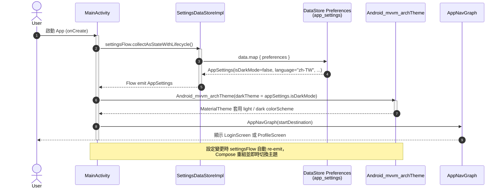

---

## 12. Settings 更新流程（User toggle → ViewModel → DataStore → UI）

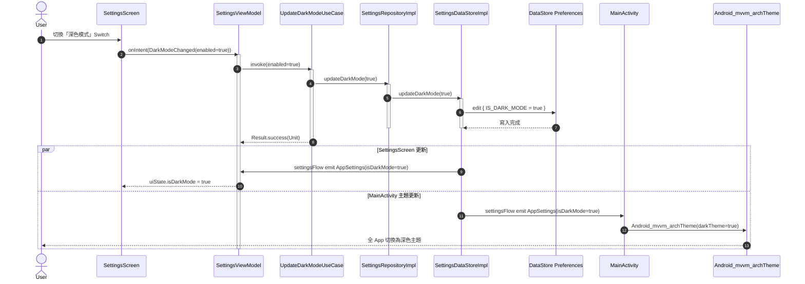

---

## 13. 清除快取流程（Privacy Settings）

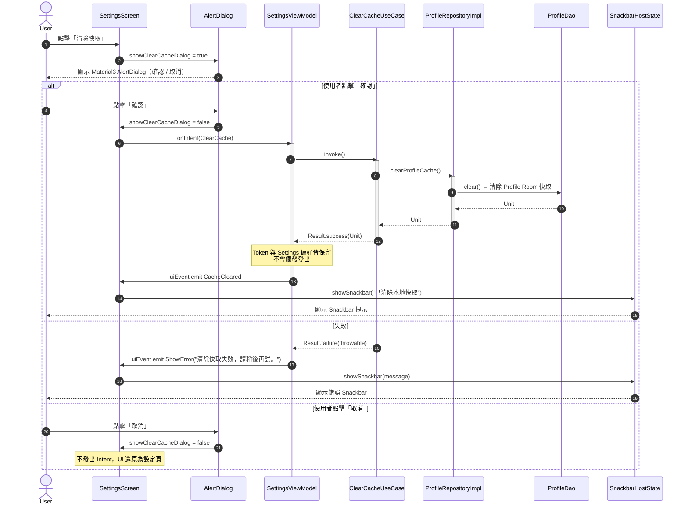

---

## 14. Settings 語言切換（UseCase 驗證）

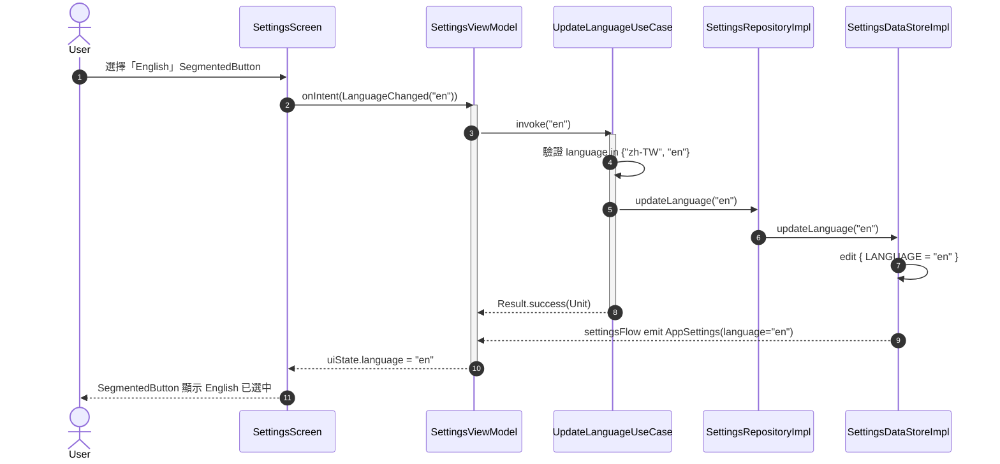

---

## 15. Notifications 列表載入與下拉刷新

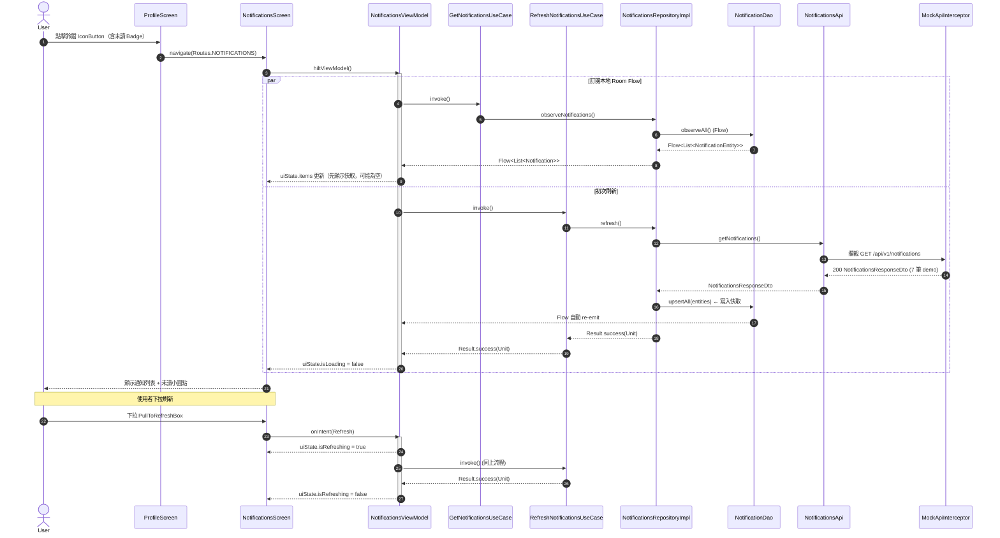

---

## 16. 標記單筆通知為已讀（樂觀更新）

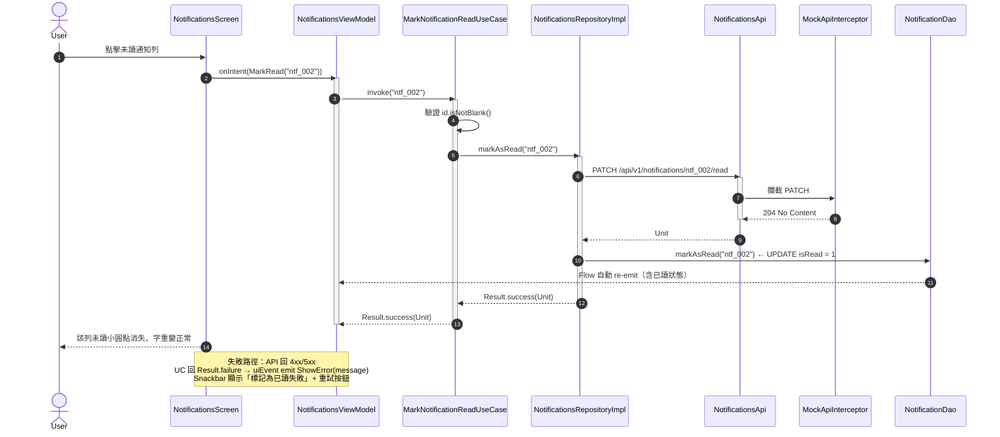

---

## 17. 全部標記為已讀

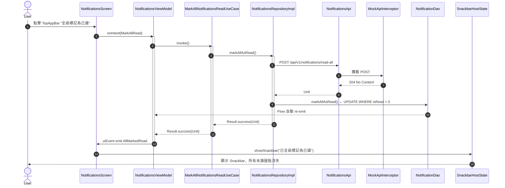

---

## 18. WorkManager 背景同步 + 系統通知

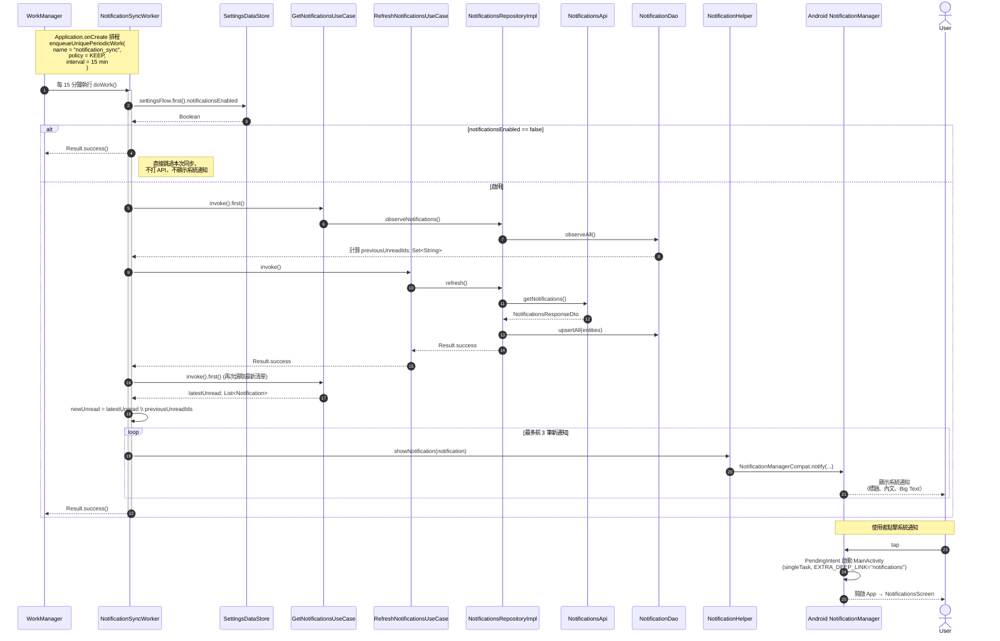

---

## 19. 系統通知 deep link 導航流程

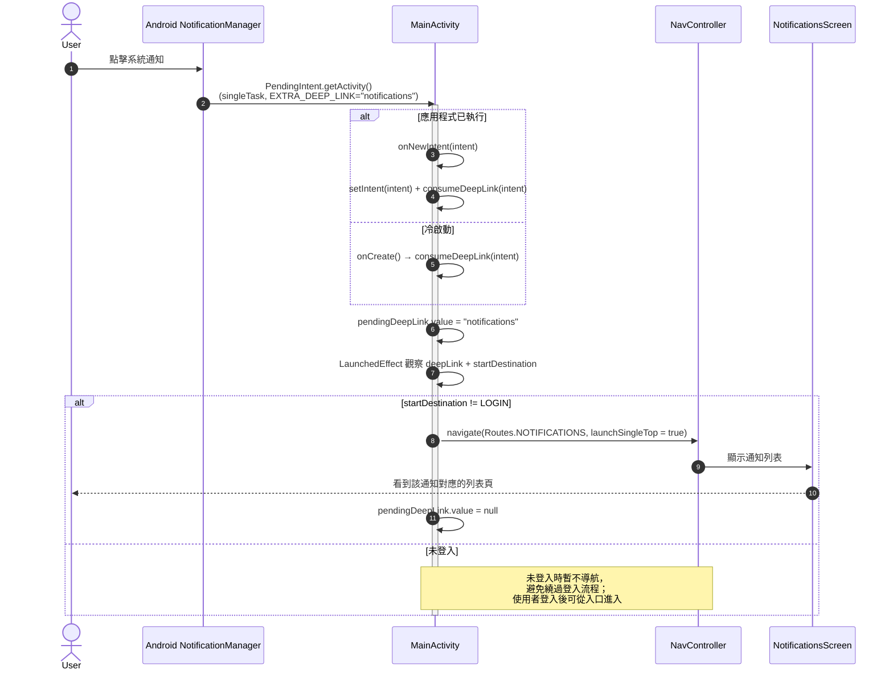

---

## 20. 更換頭像（相簿 / 相機）

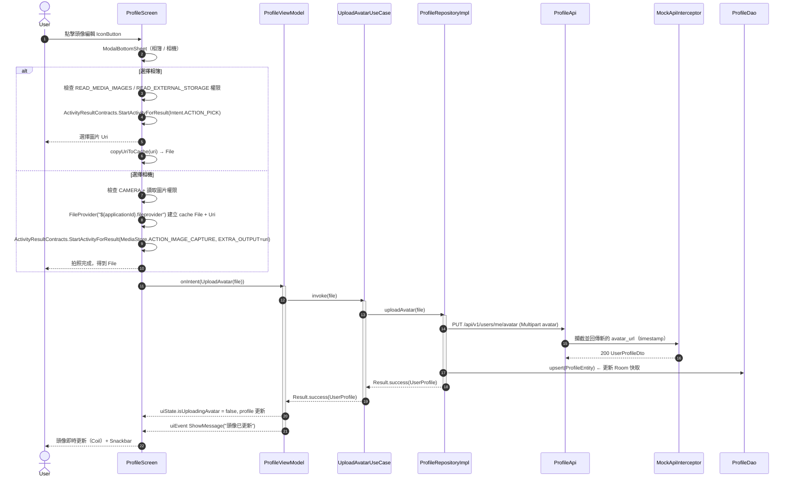

---

## 21. Notifications 分頁載入流程（Paging 3）

```mermaid
sequenceDiagram
    autonumber
    actor User
    participant NS as NotificationsScreen
    participant NVM as NotificationsViewModel
    participant LP as LazyPagingItems
    participant UC as GetNotificationsPagingUseCase
    participant Repo as NotificationsRepositoryImpl
    participant PS as NotificationsPagingSource
    participant API as NotificationsApi
    participant Mock as MockApiInterceptor
    participant DAO as NotificationDao

    User->>NS: 進入通知頁
    NS->>NVM: collect pagingDataFlow
    NVM->>UC: invoke(pageSize=20)
    UC->>Repo: getNotificationsPagingData(20)
    Repo-->>NVM: Flow<PagingData<Notification>>
    NVM-->>NS: pagingDataFlow.cachedIn(viewModelScope)
    NS->>LP: collectAsLazyPagingItems()

    LP->>PS: load(page=1, pageSize=20)
    PS->>API: GET /api/v1/notifications?page=1&pageSize=20
    API->>Mock: 攔截並分頁切片
    Mock-->>API: {items, next_page, has_more}
    API-->>PS: NotificationsResponseDto
    PS->>DAO: upsertAll(loadedPageEntities)
    PS-->>LP: LoadResult.Page(data, nextKey)
    LP-->>NS: render list + refresh/append loadState

    opt 使用者滾動到底部
        LP->>PS: load(page=next_page)
        PS->>API: GET /api/v1/notifications?page=n&pageSize=20
        API-->>PS: 下一頁資料
        PS-->>LP: LoadResult.Page(...)
        LP-->>NS: append 成功或錯誤（可 retry）
    end
```

---

## 22. 標記已讀後刷新流程（Paging 3）

```mermaid
sequenceDiagram
    autonumber
    actor User
    participant NS as NotificationsScreen
    participant NVM as NotificationsViewModel
    participant MarkUC as MarkNotificationReadUseCase
    participant Repo as NotificationsRepositoryImpl
    participant API as NotificationsApi
    participant Mock as MockApiInterceptor
    participant DAO as NotificationDao
    participant LP as LazyPagingItems

    User->>NS: 點擊未讀通知
    NS->>NVM: onIntent(MarkRead(id))
    NVM->>MarkUC: invoke(id)
    MarkUC->>Repo: markAsRead(id)
    Repo->>API: PATCH /api/v1/notifications/{id}/read
    API->>Mock: 更新 mock 通知狀態為已讀
    Mock-->>API: 204 No Content
    Repo->>DAO: markAsRead(id)
    Repo-->>MarkUC: Result.success(Unit)
    MarkUC-->>NVM: success
    NVM-->>NS: uiEvent.RefreshList
    NS->>LP: refresh()
    LP->>API: 重新載入第一頁
    API-->>LP: 最新 is_read 狀態
    LP-->>NS: UI 已讀狀態即時更新
```
