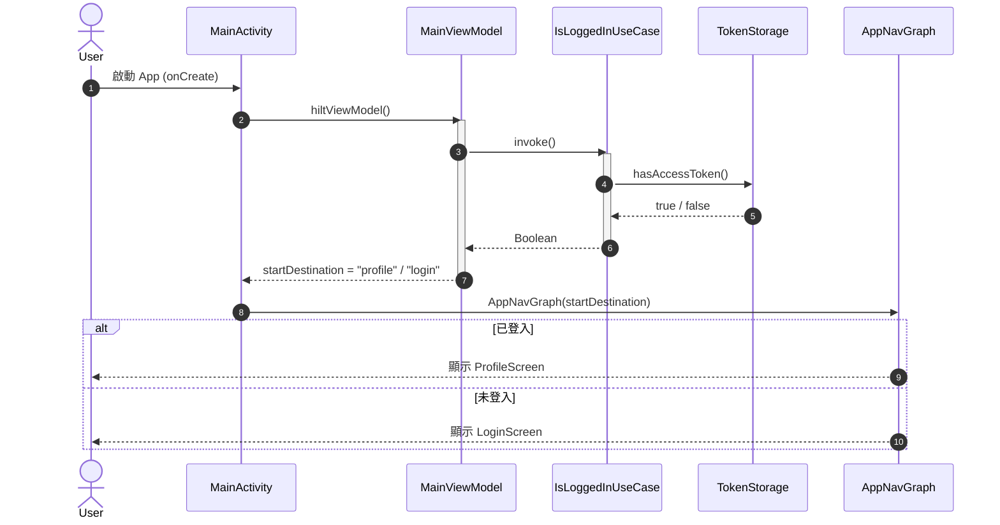
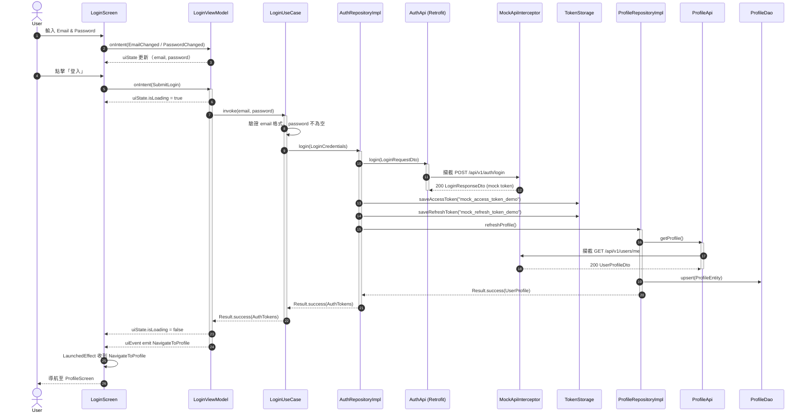
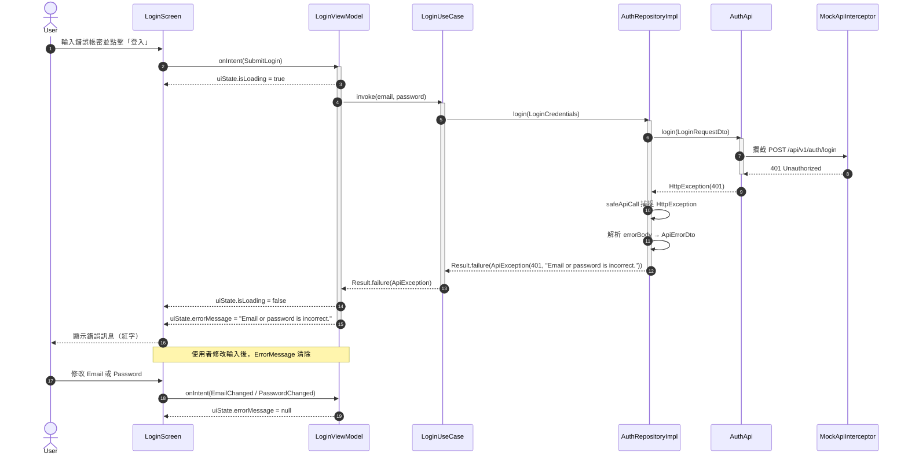
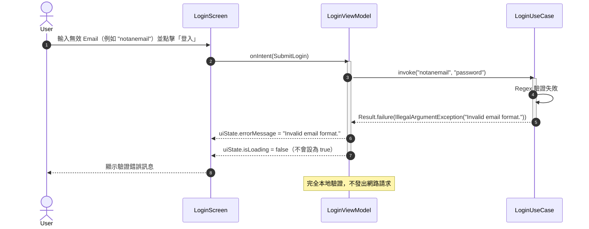
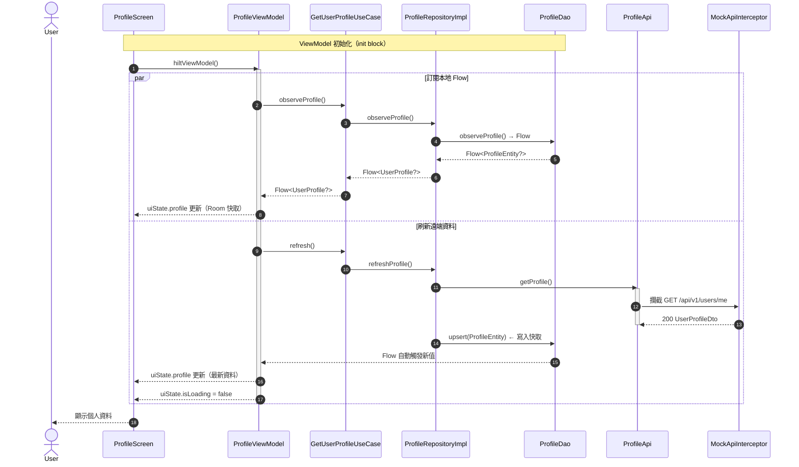
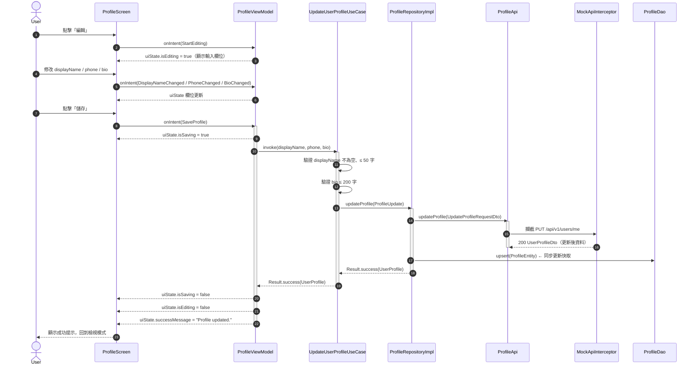
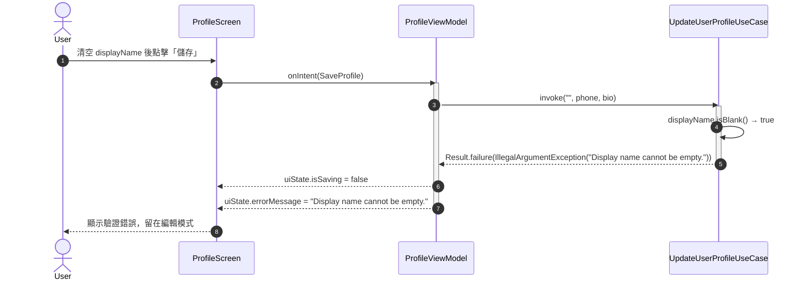
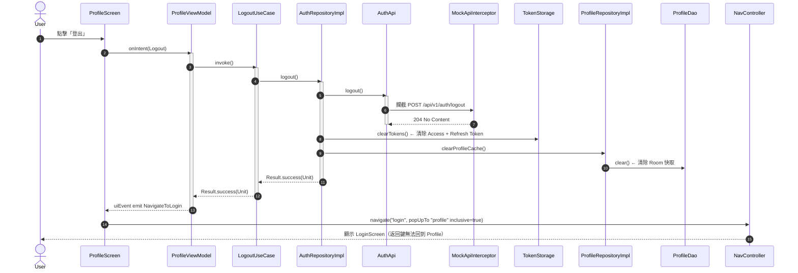
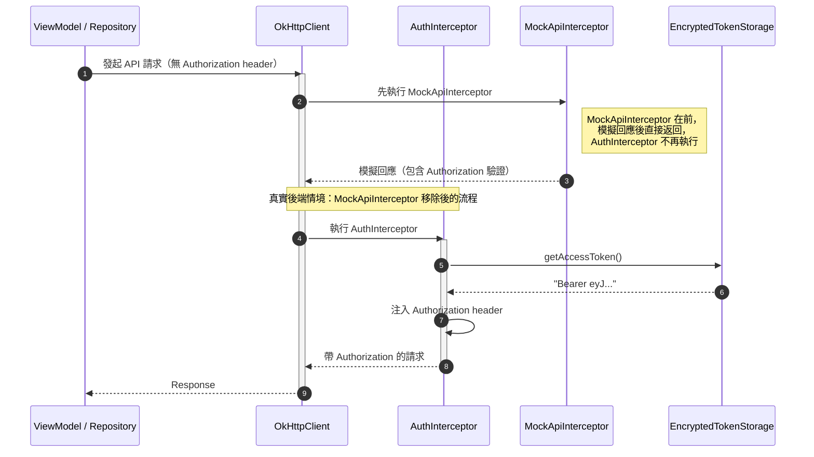
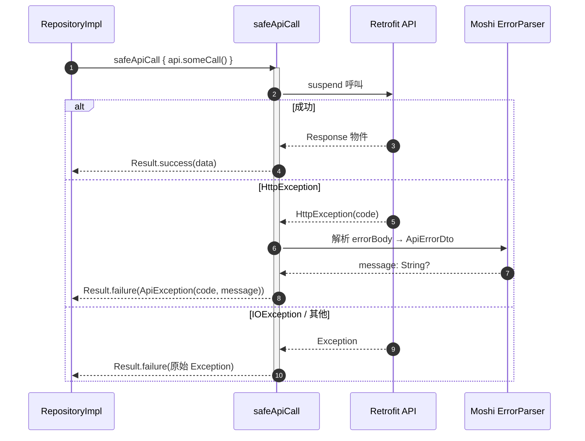

# 循序圖 (Sequence Diagram)
# Android MVVM Architecture — Auth & Profile

> 使用 [Mermaid](https://mermaid.js.org/) 語法繪製，可在 GitHub、GitLab、Markdown 預覽工具中直接渲染。

---

## 1. 應用程式啟動 — 路由決策

---

## 2. 使用者登入（成功路徑）

---

## 3. 使用者登入（失敗路徑）

---

## 4. 輸入驗證失敗（前端）

---

## 5. 個人資料頁面載入

---

## 6. 編輯並儲存個人資料

---

## 7. 編輯個人資料失敗（驗證錯誤）

---

## 8. 使用者登出

---

## 9. Token 自動附加（AuthInterceptor）

---

## 10. safeApiCall 錯誤包裝流程

