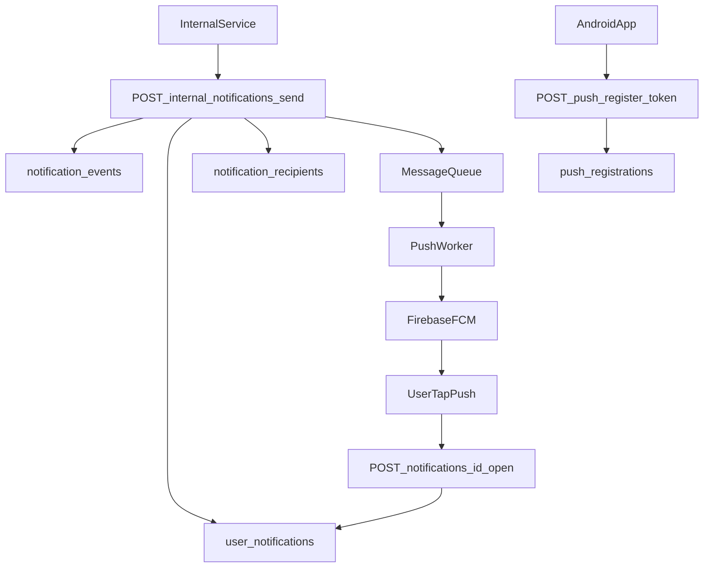
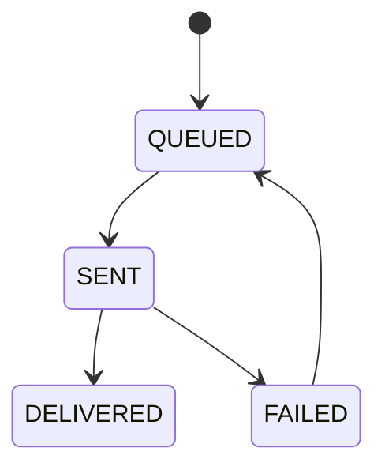

# Notification Flow Integration Guide

本文件說明通知後端實作時的相容性策略、安全設計、可觀測性與重試流程。  
目標是在不破壞現有 Android `notifications` 功能的前提下，接入 FCM 推播。

---

## 1) 與現有 App 的相容性檢查

### 1.1 不變更的既有契約

以下端點與回應欄位保持不變：

- `GET /api/v1/notifications`
- `PATCH /api/v1/notifications/{id}/read`
- `POST /api/v1/notifications/read-all`

原因：現有 App 已依賴既有 DTO 與 Repository 行為：

- `NotificationDto` 使用欄位 `id/title/body/type/is_read/created_at`
- `NotificationsResponseDto` 使用欄位 `items/next_page/has_more`
- `NotificationsRepository` 依賴 `refresh()/markAsRead()/markAllAsRead()`

### 1.2 新增但不破壞的端點

- `POST /api/v1/push/register-token`（新增）
- `POST /api/v1/internal/notifications/send`（新增）
- `POST /api/v1/notifications/{id}/open`（新增）

新增端點不會改動既有讀取/已讀 API，因此對當前 App 為非破壞性。

### 1.3 `open` 與 `read` 的語意分離

- `read`：UI 狀態（是否已讀）
- `open`：互動事件（是否點擊通知）

可同時存在，避免把行為分析綁死在 UI 狀態上。

---

## 2) 端到端事件流程

---

## 3) 認證與授權策略

### 3.1 API 認證

- `register-token`、`mark-open`：使用者 `Bearer JWT`。
- `internal send`：僅 service-to-service token（或 admin JWT with scope）。

### 3.2 `internal send` 權限

- 建議 scope：`notifications:send`。
- 建議在 API Gateway 或後端 middleware 驗 scope，不允許一般 user token 呼叫。

### 3.3 Idempotency

- `register-token`：`(user_id, device_id)` upsert。
- `send`：`idempotency_key` 唯一鍵防重送。
- `mark-open`：同 `(user_id, notification_id)` 僅記錄首次開啟時間。

---

## 4) Token 保護與資料保護

- `fcm_token` 視為敏感資料，不可出現在應用 log 或錯誤訊息中。
- DB 建議同時保存：
  - 原始 `fcm_token`（實際發送用途）
  - `token_hash`（除錯/追蹤用，避免直接暴露 token）
- 失敗紀錄與告警只顯示 `token_hash` 前綴，不顯示明文 token。
- 所有 API 與內部呼叫均使用 TLS。

---

## 5) 投遞狀態與重試策略

### 5.1 建議狀態機（`notification_recipients.delivery_status`）

### 5.2 重試規則

- 只針對可重試錯誤（5xx、timeout、暫時性 FCM 錯誤）重試。
- 指數退避：`30s -> 2m -> 10m -> 30m`，最多 4 次。
- 超過上限寫入 dead-letter queue（DLQ），供人工或排程補送。
- 遇到 token 無效（例如 FCM 判定失效）：
  - 將 `push_registrations.status` 更新為 `INACTIVE`
  - 停止對該 token 送訊息，等待下一次 `register-token` 更新

---

## 6) 可觀測性（Observability）

### 6.1 核心指標

- `notifications_send_accepted_total`
- `notifications_send_failed_total`
- `notifications_delivery_success_rate`
- `notifications_open_rate`
- `push_token_active_count`
- `push_token_inactive_count`

### 6.2 建議日誌欄位

- `trace_id`、`notification_id`、`recipient_id`、`user_id`
- `idempotency_key`
- `delivery_status`
- `provider_message_id`
- `error_code`、`retry_count`

### 6.3 稽核與分析

- `notification_events`：內容與建立來源（誰發、何時發）。
- `notification_recipients`：每位收件者投遞結果。
- `user_notifications.opened_at`：開啟事件與轉換率計算來源。

---

## 7) 後端落地順序

1. 先落地 `push_registrations` + `register-token`。
2. 落地 `notification_events`、`notification_recipients`、`user_notifications`。
3. 開通 `internal send` + queue worker + FCM 發送。
4. 補上 `mark-open` 與報表指標。
5. 最後啟用 DLQ 監控與重送作業。

